# 

[](https://github.com/yourusername/Yadviga-SLAM)

Yadviga-SLAM is a Simultaneous Localization and Mapping (SLAM) system designed specifically for web browser deployment. The project leverages modern C++ compiled to WebAssembly, enabling real-time SLAM capabilities directly in the browser without requiring any additional plugins or installations.

## Pipeline

```mermaid
%%{init: {'theme': 'base', 'themeVariables': { 'fontSize': '12px', 'fontFamily': 'arial' }}}%%
graph TD
    %% Input Node
    A["📷 Input Frames"]
    
    %% Feature Detection
    B["✅ goodFeaturesToTrack<br/>Find and Initilize good points for Tracking"]
    
    %% Optical Flow
    C["✅ calcOpticalFlowPyrLK<br/>2D Tracking"]
    
    %% Descriptors
    D["✅ ORB::create + compute<br/>Prepare Detector and Create Descriptors"]
    
    %% Feature Matching
    E["🛠️ BFMatcher<br/>Match Descriptors with newly found points"]
    
    %% Motion Estimation
    F["✅ findEssentialMat<br/>Compute camera movement between frames"]
    
    %% Pose Recovery
    G["✅ recoverPose<br/>Calculate camera translation and rotation"]
    
    %% 3D Reconstruction
    H["🛠️ triangulatePoints<br/>3D Reconstruction points"]
    
    %% Pose Estimation
    I["🛠️ solvePnP<br/>Refine camera position using 3D map"]
    
    %% RANSAC Filtering
    J["🛠️ solvePnPRansac<br/>Remove noise while refining camera position"]
    
    %% Bundle Adjustment
    K["❓ g2o / ceres / Eigen<br/>Remove drift and errors from all poses and 3D points"]
    
    %% Output
    P["🎥 Camera Pose"]
    Q["⛳️ 3D Environment Map"]
    
    %% Linear pipeline flow
    A --- B
    B --- C
    C --- D
    D --- E
    E --- F
    F --- G
    G --- H
    H --- I
    I --- J
    J --- K
    K --- P
    K --- Q
    
    %% Unified styling for all nodes
    classDef default fill:#253941, stroke-width:0, rx:10,ry:10,font-size:10px,color:#b2bfc2
    
    %% Styling for arrows
    linkStyle default stroke:#737373,stroke-width:2px
```



## Development Environment

Recommended using Visual Studio Code IDE because the project includes pre-configured development environment:
- `.vscode/tasks.json` - Automates build process for Emscripten, OpenCV, and the project
- `.vscode/launch.json` - Configures Chrome debugging with source maps
- `.vscode/settings.json` - Sets up C++ and CMake integration with Emscripten

These configurations provide:
- One-click build and debug setup
- Automatic WebAssembly compilation
- Integrated browser debugging
- CMake project configuration
- C++ IntelliSense support

## Project Setup

### Prerequisites
- CMake (version 3.10 or higher)
- Emscripten SDK
- OpenCV

### Building with VS Code

1. **Build Process**
   - Press `Ctrl+Shift+B` to open the build tasks menu
   - Three tasks will appear:
     1. "Build Emscripten" - Run first (only on first setup)
     2. "Build OpenCV" - Run second (only on first setup)
     3. "Build Yadviga" - Run third
   - After completing these tasks, the project will be ready for development

2. **Debugging**
   - Press `F5` to start debugging in Chrome
   - The debugger will automatically:
     - Start a local web server
     - Open Chrome with developer tools
     - Load the application

### Manual Setup (for other IDEs)

1. **Build Third-Party Dependencies**
   ```bash
   # Build Emscripten
   ./third_party/emsdk/build_emsdk.sh
   
   # Build OpenCV
   ./third_party/opencv/build_opencv.sh
   ```

2. **Build the Project**
   ```bash
   mkdir build
   cd build
   emcmake cmake .. -DCMAKE_CXX_FLAGS="-msimd128"
   emmake make -j4
   cp yadviga-slam.js yadviga-slam.worker.js ../web/ || echo 'Failed to copy files'
   ```

## Testing and Debugging

### Running Tests
1. Press `F5` in VS Code to start debugging
2. The debugger will launch the web application

### Testing on Mobile Devices

To test the application on mobile devices, you can use a tunnel service to expose your local development server to the internet:

1. Start the local web server using the "Start Web Server" task
2. Use a tunnel service like [Tuna](https://my.tuna.am/) to create a public URL


## License

This project is licensed under the MIT License - see the [LICENSE](LICENSE) file for details.

### Third-Party Licenses

This project uses the following third-party libraries:
- OpenCV, licensed under the Apache License 2.0
- Emscripten SDK, licensed under the MIT License

See [THIRD-PARTY-LICENSES.md](THIRD-PARTY-LICENSES.md) for more information. 