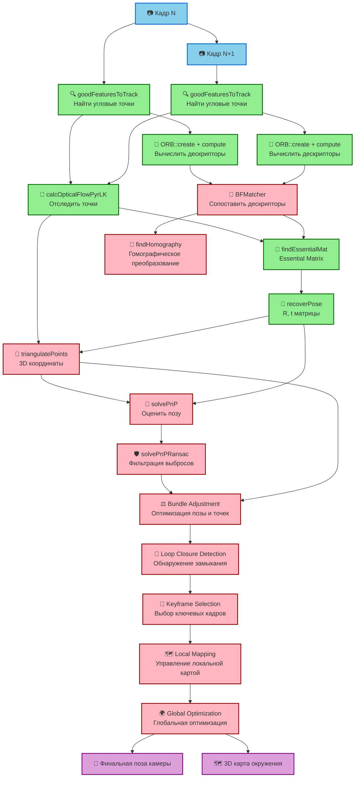

# SLAM Pipeline Graph

## Легенда

- 🟢 **Зеленые узлы** - Реализованные функции (Visual Odometry)
- 🔴 **Красные узлы** - Не реализованные функции (полный SLAM)
- 🔵 **Синие узлы** - Входные данные
- 🟣 **Фиолетовые узлы** - Выходные данные

## Описание потоков

1. **Feature Detection** → Находят угловые точки в кадрах
2. **Optical Flow** → Отслеживают движение точек между кадрами
3. **Descriptors** → Вычисляют дескрипторы для сопоставления
4. **Matching** → Сопоставляют точки между кадрами
5. **Motion Estimation** → Оценивают движение камеры
6. **3D Reconstruction** → Восстанавливают 3D структуру
7. **Pose Estimation** → Уточняют позу камеры
8. **Optimization** → Оптимизируют результаты
9. **Mapping** → Строят карту окружения

**Текущий статус**: Реализован только Visual Odometry (узлы 1-6), остальное требует доработки. 